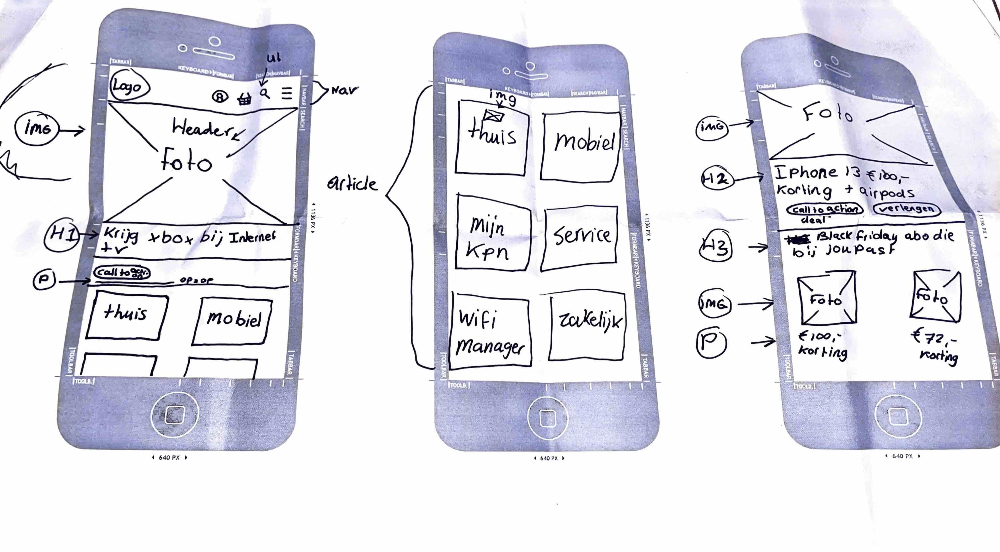
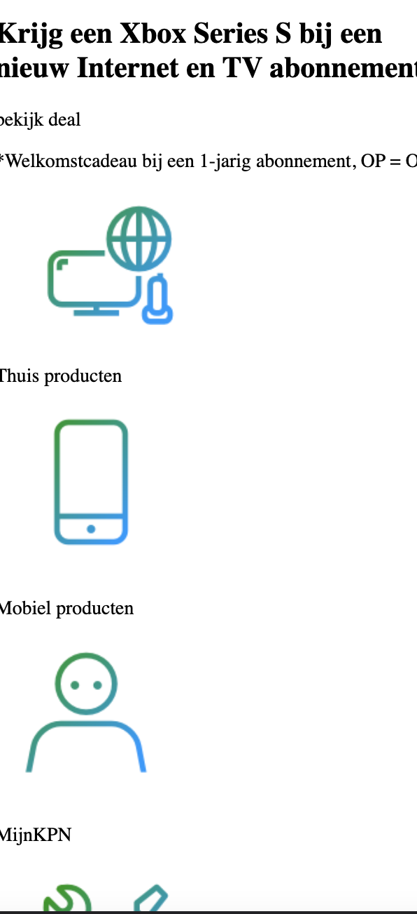
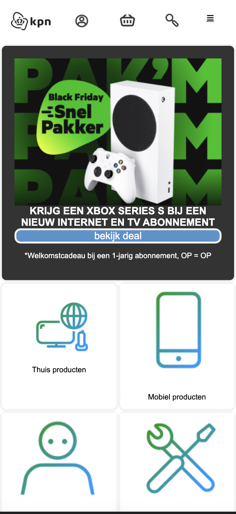
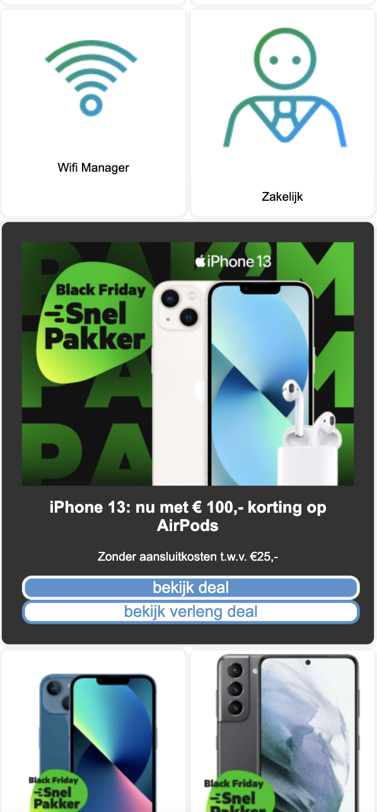

Procesverslag

uitwerken voor de kick-off werkgroep - begin van de eerste week-
Je startniveau: blauw-
Je focus: - surface plane-
Je opdracht: -kpn.com-
Screenshot(s) van de eerste pagina (small screen):

week 1
Ik heb in de eerste week een breakdown schets gemaakt op papier en ben daarna aan de slag gegaan met de html van mijn pagina.

week 2
Ik heb feedback gekregen dat mijn html er netjes uit zag. Ik ben daarna bezig geweest met de css van mijn pagina. Voor mijn gevoel is dit redelijk goed gegaan. Ik heb op W3schools en MDN gekeken voor hulp. Ik probeerde ook te kijken of ik het hamburger menu open geklapt kreeg met javascript. Dit is helaas niet gelukt. Ook loop ik nog met problemen dat ik niet weet hoe ik sommige articles kan stylen in css.

