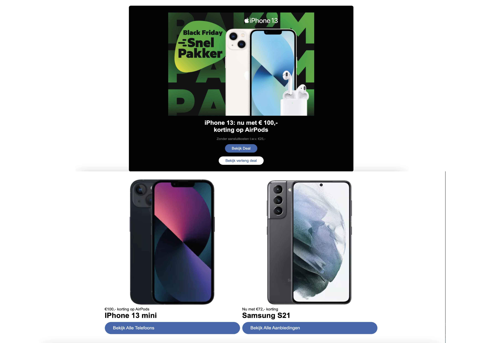

# Procesverslag
Markdown is een simpele manier om HTML te schrijven.  
Markdown cheat cheet: [Hulp bij het schrijven van Markdown](https://github.com/adam-p/markdown-here/wiki/Markdown-Cheatsheet).

Nb. De standaardstructuur en de spartaanse opmaak van de README.md zijn helemaal prima. Het gaat om de inhoud van je procesverslag. Besteedt de tijd voor pracht en praal aan je website.

Nb. Door *open* toe te voegen aan een *details* element kun je deze standaard open zetten. Fijn om dat steeds voor de relevante stuk(ken) te doen.

## Jij

uitwerken voor kick-off werkgroep

### Auteur:
Hind Largo

#### Je startniveau:
Blauw

#### Je focus:
Responsive
 

## Je website

uitwerken voor kick-off werkgroep

### Je opdracht:
https://www.kpn.com

#### Screenshot(s) van de eerste pagina (small screen): 
hier de naam van de pagina  

## Breakdownschets (week 1)

uitwerken na afloop 2e werkgroep

### de hele pagina: 
 

## Voortgang 1 (week 2)

### Stand van zaken
Ik weet niet zo goed waar ik moet beginnen, programmeren is iets waar ik niet goed in ben. Toen ik bezig geweest ben merkte ik  wel dat de breakdown schets mij voor een deel geholpen heeft.

### Agenda voor meeting
Nvt

## Voortgang 2 (week 3)

### Stand van zaken
Voor mijn gevoel ben ik al wel een stuk verder dan dat ik al was. Het ziet er nog niet helemaal uit als hoe ik het in mijn hoofd heb. Het gaat al wel een stuk beter dan vorig jaar.

### Agenda voor meeting
nvt

## Toegankelijkheidstest (week 4)

 

## Voortgang 3 (week 4)

uitwerken voor 3e voortgang

### Stand van zaken
hier dit ging goed & dit was lastig (neem ook screenshots op van delen van je website en code)

### Agenda voor meeting
samen met je groepje opstellen

| student 1      | student 2          | student 3    | student 4        |
| ---            | ---                | ---          | ---              |
| dit bespreken  | en dit             | en ik dit    | en dan ik dat    |
| en dat ook nog | dit als er tijd is | nog een punt | dit wil ik zeker |
| ...            | ...                | ...          | ...              |

### Verslag van meeting
hier na afloop snel de uitkomsten van de meeting vastleggen

- punt 1
- punt 2
- nog een punt
- ...

## Eindgesprek (week 5)

uitwerken voor eindgesprek

### Stand van zaken
hier dit ging goed & dit was lastig (neem ook screenshots op van delen van je website en code)

### Screenshot(s)

hier screenshot(s) van je eindresultaat

## Bronnenlijst

continu bijhouden terwijl je werkt

Nb. Wees specifiek ('css-tricks' als bron is bijv. niet specifiek genoeg).

1. bron 1
2. bron 2
3. ...

